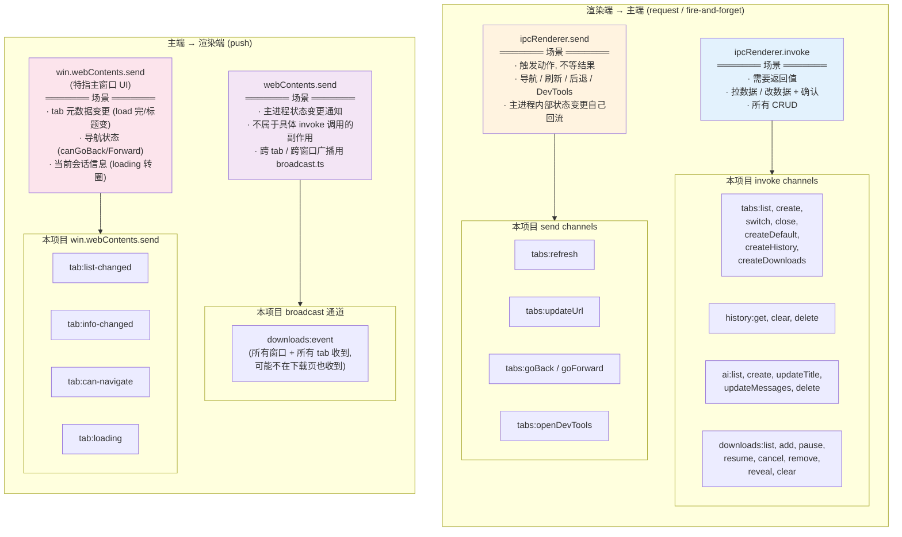
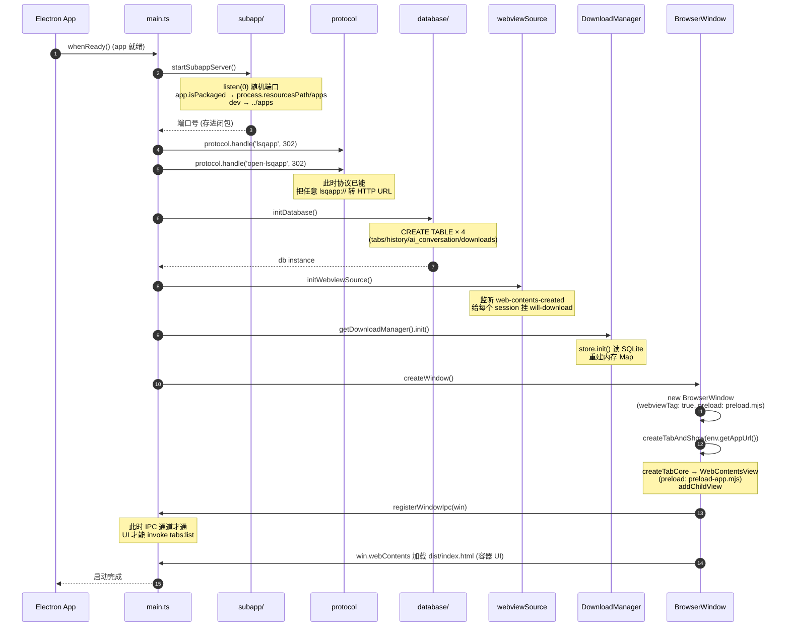
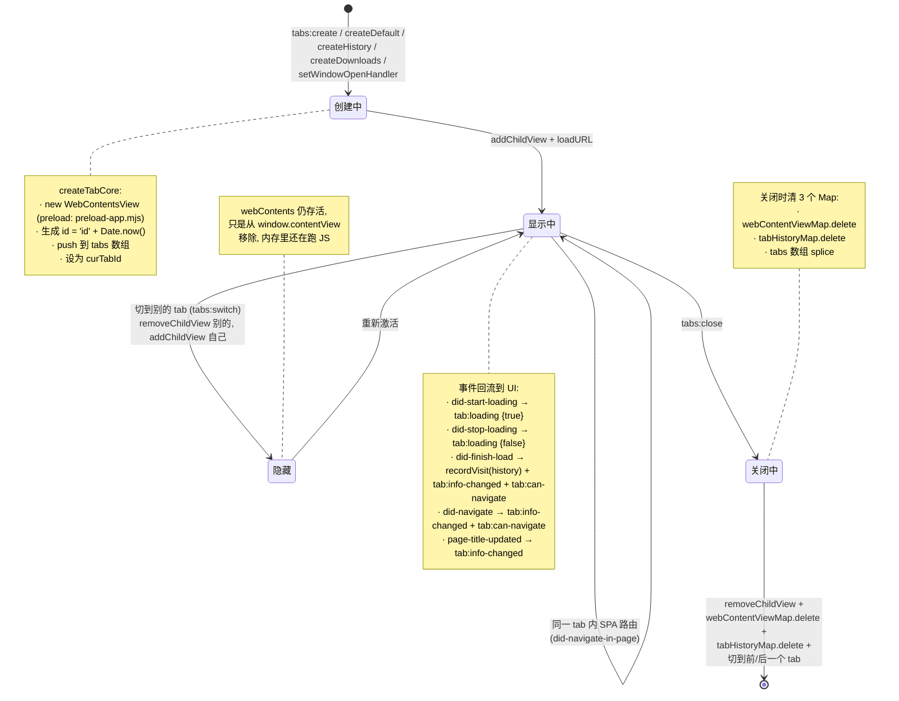
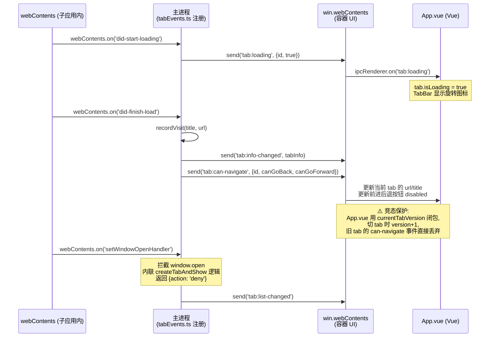
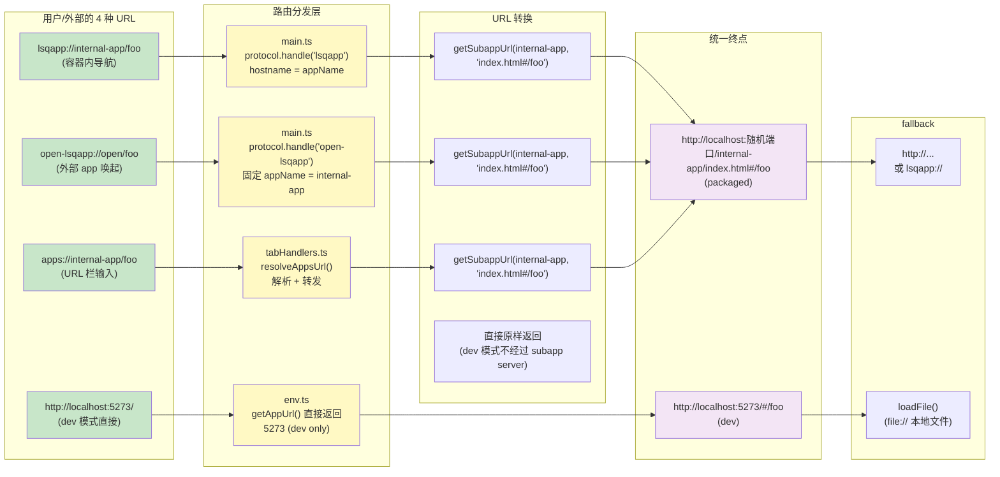
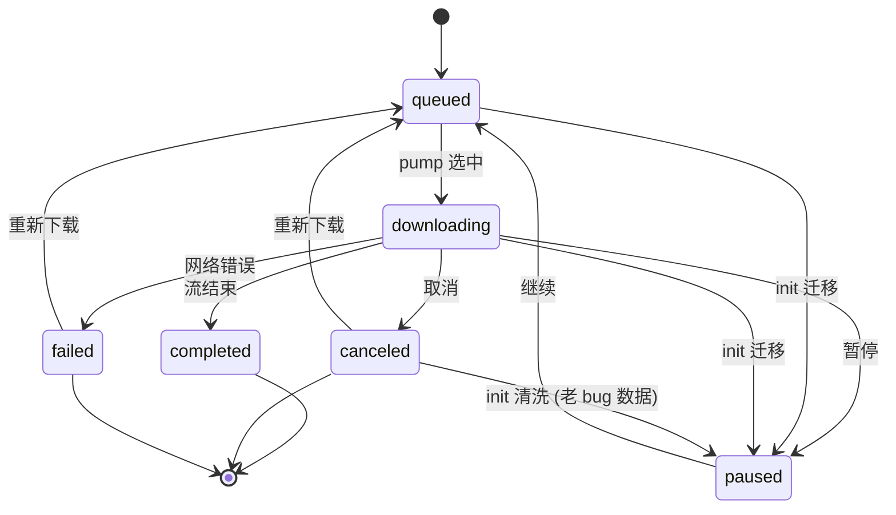
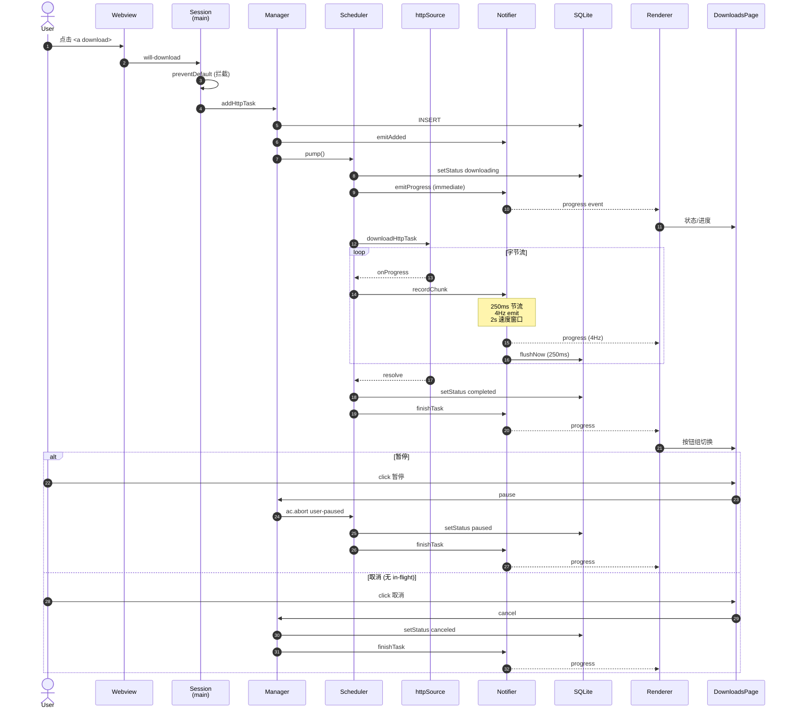
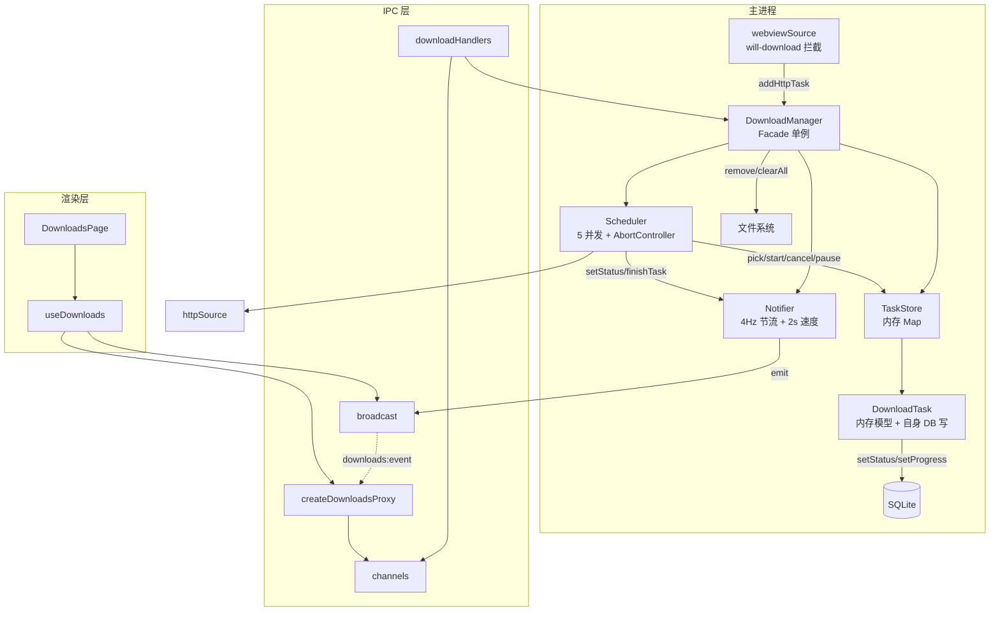

# 项目架构总览

> 5 个沉淀:
> - 1. IPC 通信模式矩阵 (本项目实际用法)
> - 2. 应用启动时序
> - 3. 标签页生命周期 + 事件回流
> - 4. URL 解析全景
> - 5. 下载管理器架构

---

## 1. IPC 通信模式矩阵

> 通用 Electron IPC 见 [INTERVIEW.md §A.3](INTERVIEW.md#a3-通信层). 本节只讲本项目实际用法.

### 一图概览

通用 Electron IPC 有 5 种 (invoke/send/webContents.send/MessagePort/postMessage), 但**本项目只用了 3 种**, 而且每种都用在了固定的语义场景. 一张表说清楚"什么意图用什么 channel".



### 三种模式如何选

| 意图 | 用哪个 | 本项目例子 |
|---|---|---|
| **我要一个答案** | `invoke` / `handle` | `tabs:list` 拉所有 tab; `ai:list` 拉所有会话; `downloads:add` 创建下载任务 |
| **去做吧, 不等结果** | `send` / `on` | `tabs:refresh` 刷新当前 tab; `tabs:goBack` 后退 |
| **状态变了, 通知 UI** | `webContents.send` | tab 加载完推 `tab:info-changed` |
| **跨窗口/跨 tab 广播** | `broadcast()` (broadcast.ts) | 下载进度要所有 webContents 收到 |

### 完整 IPC channel 清单

#### invoke (request-response)

| channel | 文件 | handler |
|---|---|---|
| `tabs:list` | tabHandlers.ts | 返回所有 tab 信息 |
| `tabs:create` | tabHandlers.ts | 创建新 tab |
| `tabs:switch` | tabHandlers.ts | 切换 tab, 推 `tab:can-navigate` |
| `tabs:close` | tabHandlers.ts | 关闭 tab, 自动切前一个 |
| `tabs:createDefault` | tabHandlers.ts | "+" 按钮 / 启动初始 tab |
| `tabs:createHistory` | tabHandlers.ts | 历史页 tab |
| `tabs:createDownloads` | tabHandlers.ts | 下载管理 tab |
| `history:get` | tabHandlers.ts | 拉所有历史 |
| `history:clear` | tabHandlers.ts | 清空 |
| `history:delete` | tabHandlers.ts | 删单条 |
| `ai:list` | tabHandlers.ts | 拉所有会话 |
| `ai:create` | tabHandlers.ts | 创建会话 |
| `ai:updateTitle` | tabHandlers.ts | 改标题 |
| `ai:updateMessages` | tabHandlers.ts | 覆盖 messages |
| `ai:delete` | tabHandlers.ts | 删会话 |
| `downloads:list` | downloadHandlers.ts | 拉所有下载任务 |
| `downloads:add` | downloadHandlers.ts | 创建 HTTP 下载任务 |
| `downloads:pause` | downloadHandlers.ts | 暂停 |
| `downloads:resume` | downloadHandlers.ts | 继续 |
| `downloads:cancel` | downloadHandlers.ts | 取消 |
| `downloads:remove` | downloadHandlers.ts | 删除 (含磁盘文件) |
| `downloads:reveal` | downloadHandlers.ts | 在文件管理器中显示 |
| `downloads:clear` | downloadHandlers.ts | 清空所有 |
| `popup:show` | popup/handlers.ts | 显示弹出面板 |
| `popup:hide` | popup/handlers.ts | 隐藏弹出面板 |
| `popup:toggle` | popup/handlers.ts | 切换显示状态 |

#### send (one-way)

| channel | 文件 | handler |
|---|---|---|
| `tabs:refresh` | tabHandlers.ts | 刷新当前 tab |
| `tabs:updateUrl` | tabHandlers.ts | URL 栏回车 |
| `tabs:goBack` | tabHandlers.ts | 后退 |
| `tabs:goForward` | tabHandlers.ts | 前进 |
| `tabs:openDevTools` | tabHandlers.ts | 打开 DevTools |

#### webContents.send (push)

| channel | 触发点 | 接收方 |
|---|---|---|
| `tab:list-changed` | 创建/关闭/切换 tab 后 | UI 重新 `tabs:list` |
| `tab:info-changed` | webContents 事件 / 导航完成 / 标题更新 | UI 更新当前 tab |
| `tab:can-navigate` | `webContents.canGoBack/Forward()` 后 | UI 更新前进后退按钮 |
| `tab:loading` | `did-start-loading` / `did-stop-loading` | UI 转圈图标 |
| `downloads:event` | (经 `broadcast()`) 进度/添加/完成/删除 | 所有 UI |

### 为什么本项目没用 MessagePort / postMessage

- **MessagePort**: 高频/长连接场景. 本项目 IPC 频率低 (用户操作驱动), 用不上.
- **`window.postMessage`**: 同源窗口间通信. 项目里没有跨窗口的同源渲染进程场景.

### 速记口诀 (本项目版)

> **invoke 拿数据, send 触发动作, 主→渲 必走 send, 跨窗口才用 broadcast**

跟通用 Electron 口诀的区别: 通用口诀强调 "MessagePort 用于高频", 本项目里 MessagePort 完全没出场, 所以简化为 3 种.

### 相关代码位置

- [electron/preload.ts](../electron/preload.ts) — `window.ipcRenderer` (基础 IPC)
- [preload/preload-app.ts](../preload/preload-app.ts) — `window.bridge.getModules` (子应用专用)
- [electron/tabs/tabHandlers.ts](../electron/tabs/tabHandlers.ts) — tabs + history + ai 的 handlers
- [electron/modules/downloads/downloadHandlers.ts](../electron/modules/downloads/downloadHandlers.ts) — downloads handlers
- [electron/shared/broadcast.ts](../electron/shared/broadcast.ts) — 跨窗口广播

---

## 2. 应用启动时序

`main.ts` 里 `app.whenReady().then()` 是一个**严格串行**的初始化链. 顺序错了整个应用起不来, 但代码里只是一串 await/调用, 缺少视觉化. 这张图把每个步骤的**实际作用 + 时序约束**画出来.



### 关键时序约束

| 步骤 | 必须在谁之前 | 为什么 |
|---|---|---|
| `startSubappServer()` | 所有 lsqapp 协议相关 | 协议 handler 需要调 `getSubappUrl(port, ...)` 拼重定向地址 |
| `registerProtocol()` | `createWindow` | 初始标签 URL 走协议重定向, 没注册就 302 失败 |
| `initDatabase()` | `getDownloadManager().init()` | 加载历史下载任务需要先有表 |
| `initWebviewSource()` | 任何 webContents 创建 | 监听的是 `web-contents-created` 全局事件, 必须在窗体出现前挂上 |
| `registerWindowIpc(win)` | UI 渲染 (`win.webContents.send` 或 `invoke`) | UI 启动后会立刻 `tabs:list`, 没注册就拿不到数据 |

### 怎么读这张图

- **第 3-4 步的协议注册**必须在 createWindow **之前**——否则第一个 tab 加载时协议没注册, URL 解析会失败.
- **第 5-7 步是"打开数据库 + 注册下载源 + 加载历史任务"**——因为重启时要恢复未完成的下载, 顺序不严格但要早于 UI 出现.
- **`registerWindowIpc` 在 createWindow 内部**, 这意味着 IPC channel 在 UI 渲染之前已就绪——否则 UI 的 `tabs:list` 会 invoke 失败.

### 相关代码位置

- [electron/mainEntry/appReady.ts](../electron/mainEntry/appReady.ts) — `appReadyInit()` 编排
- [electron/subapp-server/index.ts](../electron/subapp-server/index.ts) — 子应用 HTTP 服务器启动
- [electron/shared/database/index.ts](../electron/shared/database/index.ts) — 数据库初始化
- [electron/modules/downloads/manager/sources/webviewSource.ts](../electron/modules/downloads/manager/sources/webviewSource.ts) — 下载源拦截
- [electron/modules/downloads/manager/index.ts](../electron/modules/downloads/manager/index.ts) — 下载管理器 init

---

## 3. 标签页生命周期 + 事件回流

标签是整个项目**状态最复杂**的部分. 主进程持有 `webContentViewMap` (权威状态), 渲染端通过 `tab:*` 事件**反向回流**到 UI. 这是一个**单向数据流**: 主进程 → 事件 → UI.

### 状态机



### 配套事件流图 (UI ← 主进程)



### 关键设计点

#### 1. 状态在主进程, UI 永远是镜像

`webContentViewMap` (tabCore.ts:80) 是真相, UI 的 `tabs.value` 是从 `tabs:list` 拉回来的副本. 任何 tab 元数据变更 (加载中/标题/URL/前进后退) 都通过事件回流.

#### 2. `tab:can-navigate` 的版本号防竞态

切换 tab 是异步的, 中间可能穿插旧 tab 的 can-navigate 事件, 版本号让 UI 能识别"这是过期消息":

```ts
// App.vue:88-89
const switchTab = async (tabId: string) => {
  currentTabId.value = tabId
  await window.ipcRenderer.invoke('tabs:switch', tabId)
  currentTabVersion++  // 切换完成后版本号+1
}

window.ipcRenderer.on('tab:can-navigate', (_event, data) => {
  const expectedVersion = currentTabVersion
  if (data.id === currentTabId.value) {
    // 只更新匹配当前 version 的事件
  }
})
```

#### 3. `setWindowOpenHandler` 是 webview 的"iframe sandbox"

子应用调 `window.open` 不弹系统窗口, 而是在容器内开新 tab (tabEvents.ts:24-44)——这是浏览器外壳的标配行为. 内联了 `createTabAndShow` 逻辑避免循环依赖.

#### 4. 隐藏 ≠ 销毁

切到别的 tab 时只调 `win.contentView.removeChildView(view)`, webContents 实例**仍然存活**, JS 仍在跑. 这是 Electron WebContentsView 的设计——销毁要显式 `view.destroy()`, 项目里没用到销毁路径.

#### 5. 关闭时清理 3 个数据结构

`closeTab` (tabCore.ts:147-171) 同时清理:
- `webContentViewMap.delete(id)` — 标签 + view 引用
- `tabHistoryMap.delete(id)` — 该 tab 的前进后退栈
- `tabs.splice(idx, 1)` — 数组索引

### 4 种创建入口

| IPC channel | 用途 | 默认 URL |
|---|---|---|
| `tabs:create` | 用户书签打开 | 入参 `{title, url}` |
| `tabs:createDefault` | "+" 按钮 / 启动初始 tab | `env.getAppUrl()` |
| `tabs:createHistory` | "历史"按钮 | `env.getHistoryUrl()` |
| `tabs:createDownloads` | "下载"书签 | `env.getDownloadsUrl()` |

### 关键边界

| 在哪儿改 | 谁改 | 备注 |
|---|---|---|
| `webContentViewMap` | tabCore.ts 内部 | 唯一权威源 |
| `tabs[]` 数组 | tabCore.ts 内部 | 跟 Map 同步, 用于按索引切换 |
| `tab.info.url/actualUrl/title/isLoading/canGoBack/canGoForward` | tabEvents / tabNavigation | 双轨制 |
| UI `tabs.value` | App.vue 监听 `tab:list-changed` 后 `invoke('tabs:list')` 重新拉 | 全量拉, 不增量 |

### 相关代码位置

- [electron/tabs/state/tabCore.ts](../electron/tabs/state/tabCore.ts) — 状态 + 创建/切换/关闭核心
- [electron/tabs/tabHandlers.ts](../electron/tabs/tabHandlers.ts) — IPC handlers
- [electron/tabs/tabEvents.ts](../electron/tabs/tabEvents.ts) — webContents 事件监听
- [electron/tabs/tabNavigation.ts](../electron/tabs/tabNavigation.ts) — 后退/前进/刷新
- [src/App.vue](../src/App.vue) — UI 端 tab 列表 + 版本号防竞态
- [src/components/TabBar.vue](../src/components/TabBar.vue) — 标签栏渲染

---

## 4. URL 解析全景

项目里有 **4 种 URL 入口**, 各自走不同路径, 但最终都汇聚到子应用 HTTP 服务器的同一个 URL. 新人看代码经常晕——同一个 `http://localhost:随机端口/internal-app/index.html#/foo` 怎么从这么多地方拼出来.



### 三种协议的本质区别

| 协议 | 注册位置 | hostname 含义 | 用途 | 外部可唤起 |
|---|---|---|---|---|
| `lsqapp://` | `main.ts:86` | 子应用名 (`internal-app`) | 容器内导航 | ❌ |
| `open-lsqapp://` | `main.ts:97` | 任意 (被忽略) | 外部 app 唤起容器 | ✅ |
| `apps://` | `tabHandlers.ts:17` | 子应用名 | URL 栏简写 | ❌ |

**关键观察**: `lsqapp` 和 `open-lsqapp` 看起来协议名不同, 但走的都是 `getSubappUrl()` 同一个函数. 区别只在于 hostname 是否被子应用名占用.

### 怎么读这张图

- **3 个协议入口 → 同一条出口**: `lsqapp` / `open-lsqapp` / `apps://` 走的都是 `getSubappUrl()` 同一个函数, **packaged 模式下最终 URL 完全一样**.
- **dev 模式是"快路"**: `env.getAppUrl()` 直接返回 `localhost:5273`, 不经过 subapp server. 这是因为 Vite dev server 已经在跑了, 多此一举会绕一圈.
- **fallback 在 tabHandlers.ts** (tabHandlers.ts:55-59): 如果 URL 不是 http/lsqapp/apps 开头, 就当本地文件路径, `view.webContents.loadFile()` 加载.
- **关键观察**: URL 解析逻辑**分散在 4 处** (main 协议 / tabHandlers resolveAppsUrl / env / 兜底), 改 URL 行为时**必须四同步**——CLAUDE.md 里也专门提了.

### 双轨制: url vs actualUrl

`TabInfo` (tabCore.ts:8-17) 有两个 URL 字段:

- `url` — **显示用**, 用户在标签栏/URL 栏看到的 (`lsqapp://internal-app/ai`)
- `actualUrl` — **加载用**, 真实 HTTP URL (`http://localhost:1234/internal-app/index.html#/ai`)

原因: 用户看到的是干净的协议名, 内部加载需要真实地址. `tabHandlers.ts` 和 `tabEvents.ts` 里到处都在维护这两个字段的一致性.

### 相关代码位置

- [electron/mainEntry/protocol.ts](../electron/mainEntry/protocol.ts) — registerProtocol
- [electron/shared/env.ts](../electron/shared/env.ts) — dev/packaged URL 解析
- [electron/tabs/tabHandlers.ts](../electron/tabs/tabHandlers.ts) — `resolveAppsUrl`
- [electron/subapp-server/index.ts](../electron/subapp-server/index.ts) — `getSubappUrl`
- [electron/tabs/state/tabCore.ts](../electron/tabs/state/tabCore.ts) — `TabInfo` 双 URL 字段

---

## 5. 下载管理器架构

主进程 `electron/downloads/` 模块的可视化说明。三张图分别覆盖：状态正确性、IPC 时序、模块耦合。

### 5.1 状态机

**看什么**：状态转移是否完整、init 迁移是否覆盖所有 case、终态是否只有 3 个。



**关键点**：
- 6 个状态里 3 个非终态（queued / downloading / paused）+ 3 个终态（completed / canceled / failed）
- 任意非终态 → 终态 的转移都来自 `downloadScheduler` 的 catch 块
- init 时把 in-flight (queued/downloading) 一律转 paused，避免静默后台下载

### 5.2 IPC 时序

**看什么**：事件顺序、节流时序、错误分支是否到位、竞态点在哪。



**关键点**：
- `event.preventDefault()` 在 SES 层就把 Chromium 拦掉，主进程自己拉
- 状态变更（downloading/paused/canceled/completed）走 `emitProgress` **immediate** 路径，不被 250ms 节流
- 字节流进度走 `recordChunk` → `scheduleProgressEmit` 节流路径
- 取消分两条路：in-flight 走 abort catch 块；非 in-flight（queued/paused）走 manager 直 setStatus

### 5.3 模块依赖

**看什么**：耦合方向是否单向、数据归属是否清晰、抽象层有没有冗余。



**关键点**：
- Manager 是唯一对外入口，Store/Scheduler/Notifier 之间不互相调用，都走 Manager 编排
- 数据归属：`DownloadTask` 自己写回 DB（避免 store 中转的间接层），Store 只管 list-level 增删查
- IPC 三层：handler (主) → channel (常量) → proxy (preload)，render 端看不到 push channel
- 渲染层 `useDownloads` 只持 proxy + event 订阅，event 流驱动 `tasks[]` 和 `progressMap`，不主动 refetch