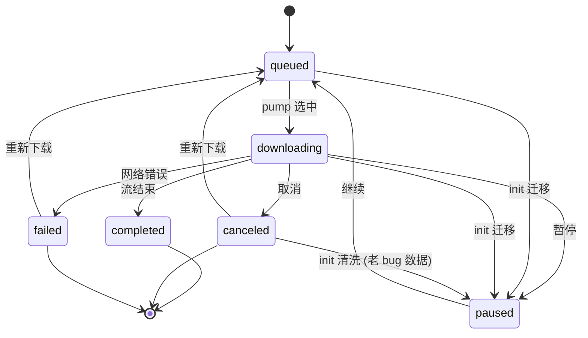
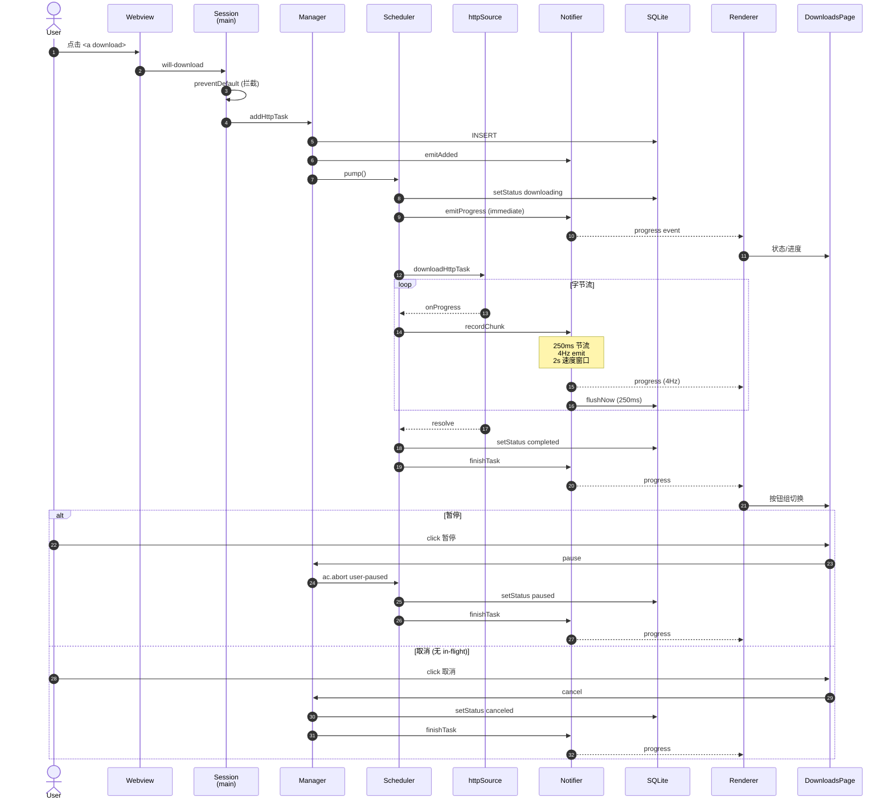
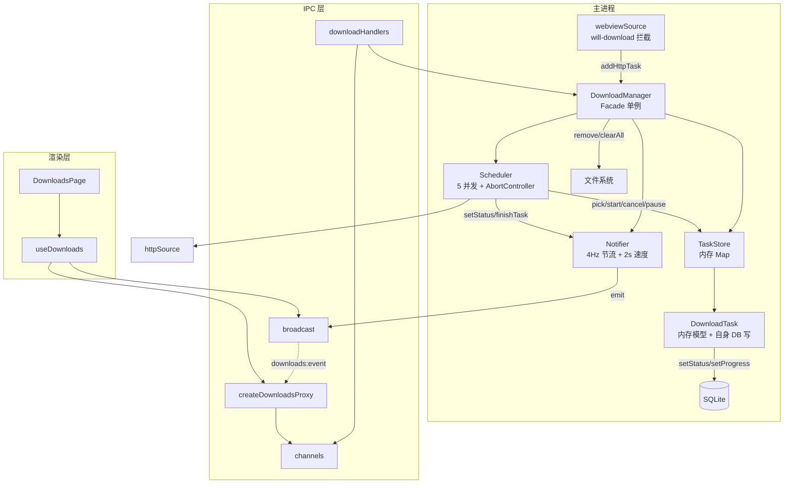

# 下载管理器架构

主进程 `electron/downloads/` 模块的可视化说明。三张图分别覆盖：状态正确性、IPC 时序、模块耦合。

---

## 1. 状态机

**看什么**：状态转移是否完整、init 迁移是否覆盖所有 case、终态是否只有 3 个。

**关键点**：
- 6 个状态里 3 个非终态（queued / downloading / paused）+ 3 个终态（completed / canceled / failed）
- 任意非终态 → 终态 的转移都来自 `downloadScheduler` 的 catch 块
- init 时把 in-flight (queued/downloading) 一律转 paused，避免静默后台下载

---

## 2. IPC 时序

**看什么**：事件顺序、节流时序、错误分支是否到位、竞态点在哪。

**关键点**：
- `event.preventDefault()` 在 SES 层就把 Chromium 拦掉，主进程自己拉
- 状态变更（downloading/paused/canceled/completed）走 `emitProgress` **immediate** 路径，不被 250ms 节流
- 字节流进度走 `recordChunk` → `scheduleProgressEmit` 节流路径
- 取消分两条路：in-flight 走 abort catch 块；非 in-flight（queued/paused）走 manager 直 setStatus

---

## 3. 模块依赖

**看什么**：耦合方向是否单向、数据归属是否清晰、抽象层有没有冗余。

**关键点**：
- Manager 是唯一对外入口，Store/Scheduler/Notifier 之间不互相调用，都走 Manager 编排
- 数据归属：`DownloadTask` 自己写回 DB（避免 store 中转的间接层），Store 只管 list-level 增删查
- IPC 三层：handler (主) → channel (常量) → proxy (preload)，render 端看不到 push channel
- 渲染层 `useDownloads` 只持 proxy + event 订阅，event 流驱动 `tasks[]` 和 `progressMap`，不主动 refetch
